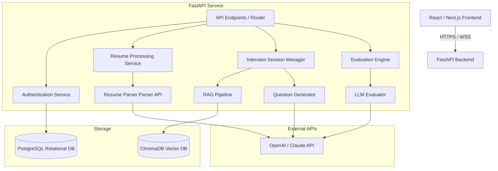

# System Architecture

This document describes the high-level architecture of **InterviewIQ AI**, a mock interview preparation platform.

## High-Level Component Layout

## Core Workflows

### 1. Resume Parsing Workflow
1. User uploads a PDF/Word resume through the frontend.
2. The frontend sends a POST request to `/api/v1/resumes/upload`.
3. The backend saves the document and forwards it to the `ai/resume_parser` module.
4. The resume parser extracts candidate metadata, skills, work history, and projects using specialized heuristics and LLM extraction schemas.
5. Extracted data is saved in PostgreSQL, and a structured candidate profile is returned to the frontend.

### 2. Adaptive Interviewing Workflow
1. Candidate starts a new mock interview session, specifying a target role/company.
2. The RAG pipeline queries the Vector database (`ChromaDB`) for relevant role-specific or company-specific questions.
3. The `ai/question_generator` integrates these template questions with the parsed candidate profile to construct the first personalized interview question.
4. The system streams the question as text and audio (via TTS).
5. The candidate records their response (sent as audio or text via STT).
6. The system process the response and adaptively generates the next question based on the response accuracy.

### 3. Evaluation and Report Generation
1. Once the interview is complete, the `ai/evaluation_engine` receives the full dialogue history.
2. The LLM evaluates the candidate's answers across multiple dimensions (technical accuracy, communication style, structure, confidence).
3. The system computes a cumulative score, generates structured feedback, and compiles a performance report.
4. The report is saved to PostgreSQL, and the frontend updates the analytics dashboard with visual graphs and a personalized learning roadmap.
