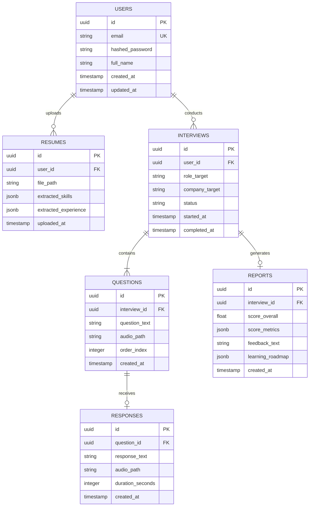

# Database Design and Schema

This document outlines the database schema and relationships for **InterviewIQ AI** built with PostgreSQL.

## Entity-Relationship Diagram (ERD)

## Schema Definitions

### Users Table (`users`)
- `id` (UUID, Primary Key): Unique identifier.
- `email` (VARCHAR, Unique, Indexed): User email address.
- `hashed_password` (VARCHAR): Secure password hash.
- `full_name` (VARCHAR): User name.
- `created_at` (TIMESTAMP): Creation date.

### Resumes Table (`resumes`)
- `id` (UUID, Primary Key): Unique identifier.
- `user_id` (UUID, Foreign Key ➔ `users.id`): Associated candidate.
- `file_path` (VARCHAR): Location of raw document on disk/storage bucket.
- `extracted_skills` (JSONB): Parsed skills list.
- `extracted_experience` (JSONB): Structured job history.
- `uploaded_at` (TIMESTAMP): Upload timestamp.

### Interviews Table (`interviews`)
- `id` (UUID, Primary Key): Unique identifier.
- `user_id` (UUID, Foreign Key ➔ `users.id`): Candidate undergoing the mock interview.
- `role_target` (VARCHAR): Target role title (e.g., "Software Engineer").
- `company_target` (VARCHAR): Target company (e.g., "Google").
- `status` (VARCHAR): Current state (`scheduled`, `in_progress`, `completed`, `failed`).
- `started_at` (TIMESTAMP): Start timestamp.

### Questions Table (`questions`)
- `id` (UUID, Primary Key): Unique identifier.
- `interview_id` (UUID, Foreign Key ➔ `interviews.id`): Associated interview.
- `question_text` (TEXT): The generated query text.
- `audio_path` (VARCHAR, Optional): Path to generated TTS speech asset.
- `order_index` (INTEGER): Sequence ranking.

### Responses Table (`responses`)
- `id` (UUID, Primary Key): Unique identifier.
- `question_id` (UUID, Foreign Key ➔ `questions.id`): Associated question.
- `response_text` (TEXT): Transcript of candidate response.
- `audio_path` (VARCHAR, Optional): Path to saved user audio response.
- `duration_seconds` (INTEGER): Time taken to answer.

### Reports Table (`reports`)
- `id` (UUID, Primary Key): Unique identifier.
- `interview_id` (UUID, Foreign Key ➔ `interviews.id`, Unique): Associated interview session.
- `score_overall` (FLOAT): Overall score (0.0 to 100.0).
- `score_metrics` (JSONB): Breakdown of sub-scores (Accuracy, Style, Structure, Confidence).
- `feedback_text` (TEXT): High-level feedback and critiques.
- `learning_roadmap` (JSONB): Adaptive study roadmap mapping suggestions to weak spots.
